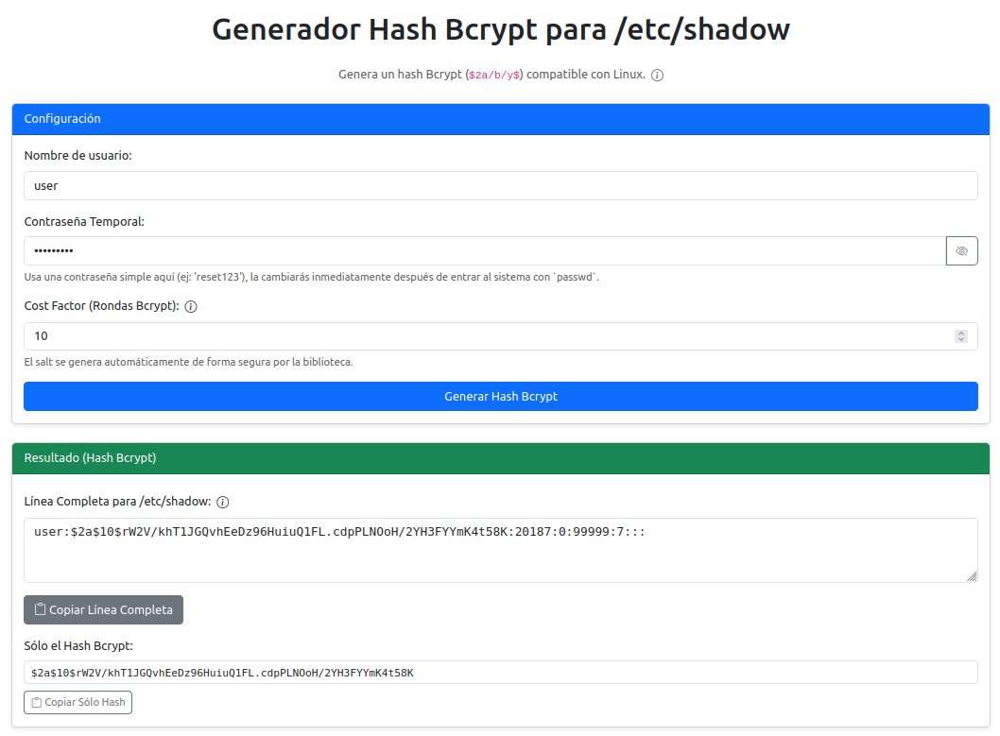

# bcrypt-shadow-generator 🔑

[](https://github.com/soyunomas/bcrypt-shadow-generator/blob/main/LICENSE)
[](https://soyunomas.github.io/bcrypt-shadow-generator/index.html)

Una sencilla herramienta web 🌐 para generar hashes **Bcrypt** (`$2a/b/y$...`) compatibles con el archivo `/etc/shadow` de Linux. Diseñada principalmente para ayudar en la recuperación de contraseñas olvidadas mediante un Live CD/USB 🐧.

## Captura de Pantalla 📸



## Demo en Vivo 🚀

Puedes probar la herramienta directamente en tu navegador aquí:
👉 **[https://soyunomas.github.io/bcrypt-shadow-generator/index.html](https://soyunomas.github.io/bcrypt-shadow-generator/index.html)**

## Características Principales ✨

*   ✅ Genera hashes **Bcrypt reales** (`$2a/b/y$`), compatibles con la mayoría de sistemas Linux modernos.
*   ✅ Interfaz web simple e intuitiva construida con Bootstrap 5.
*   ✅ Permite especificar el "Cost Factor" (rondas) de Bcrypt.
*   ✅ Funciona 100% en el lado del cliente (navegador), **ninguna contraseña se envía a ningún servidor**. 🔒
*   ✅ Muestra la línea completa formateada para `/etc/shadow` y también el hash por separado.
*   ✅ Botones para copiar fácilmente los resultados al portapapeles.
*   ✅ Incluye instrucciones detalladas (en tooltip) sobre el proceso de recuperación con Live CD.

## Cómo Usar para Recuperación de Contraseña 📝

Esta herramienta está pensada para el siguiente escenario: has olvidado tu contraseña de Linux y necesitas acceso temporal para restablecerla.

1.  **Arranca desde un Live CD/USB:** Inicia tu ordenador usando un medio Live de Linux.
2.  **Identifica tu Partición:** Abre una terminal y usa `lsblk` o `sudo fdisk -l` para encontrar la partición raíz de tu instalación Linux (ej. `/dev/sda2`, `/dev/nvme0n1p3`). Busca la de mayor tamaño o la que indique "Linux filesystem" o similar.
3.  **Monta la Partición:** Crea un punto de montaje y monta la partición (reemplaza `/dev/sdXN` con la correcta):
    ```bash
    sudo mkdir /mnt/linux
    sudo mount /dev/sdXN /mnt/linux
    ```
4.  **¡Haz una Copia de Seguridad!:** Es crucial tener un respaldo antes de cualquier modificación:
    ```bash
    sudo cp /mnt/linux/etc/shadow /mnt/linux/etc/shadow.bak
    ```
5.  **Usa esta Herramienta Web:**
    *   Abre la [Demo en Vivo](https://soyunomas.github.io/bcrypt-shadow-generator/index.html).
    *   Introduce el **nombre de usuario** afectado en el campo correspondiente.
    *   Escribe una **contraseña temporal simple** (ej. `reset123` o `tempPass`) en el campo de contraseña. ¡Asegúrate de recordarla!
    *   Ajusta el "Cost Factor" si lo deseas (10 es un buen valor por defecto).
    *   Haz clic en "Generar Hash Bcrypt".
    *   Copia el **Hash Bcrypt** resultante (la cadena que empieza por `$2a$... o similar) usando el botón "Copiar Sólo Hash".
6.  **Edita `/etc/shadow`:** Vuelve a la terminal del Live CD y edita el archivo:
    ```bash
    sudo nano /mnt/linux/etc/shadow
    ```
7.  **Reemplaza el Hash Antiguo:**
    *   Usa las flechas del teclado para moverte hasta la línea de tu usuario (ej. `miusuario:HASH_ANTIGUO_AQUI:...`).
    *   Borra con cuidado **solo** el hash antiguo (el texto largo entre los dos primeros `:`).
    *   Pega el nuevo hash Bcrypt que copiaste de la herramienta web.
    *   La línea debería quedar similar a esto: `miusuario:$2a$10$NuevoHashGeneradoAqui...:19790:0:99999:7:::` (los números del final pueden variar).
8.  **Guarda y Sal:** En `nano`, presiona `Ctrl+O`, luego `Enter` para confirmar el nombre del archivo, y después `Ctrl+X` para salir.
9.  **Desmonta y Reinicia:**
    ```bash
    sudo umount /mnt/linux
    sudo reboot
    ```
    (Recuerda quitar el Live CD/USB antes de que arranque de nuevo).
10. **Accede y Cambia la Contraseña:**
    *   El sistema debería arrancar normalmente.
    *   Inicia sesión con tu nombre de usuario y la **contraseña temporal** que usaste en la herramienta web.
    *   **Inmediatamente después de entrar**, abre una terminal y ejecuta el comando `passwd`.
    *   El sistema te pedirá la contraseña actual (la temporal) y luego te pedirá que introduzcas y confirmes tu **nueva contraseña segura**.

¡Listo! Has recuperado el acceso y establecido una contraseña segura.

## Consideraciones Importantes ⚠️

*   **Seguridad:** Toda la generación del hash ocurre localmente en tu navegador usando JavaScript (`bcrypt.js`). Tu contraseña (temporal) nunca sale de tu máquina ni se envía a ningún servidor.
*   **Propósito:** Esta herramienta genera un hash válido para permitir el *acceso temporal* y el posterior reseteo con `passwd`. No está pensada para generar hashes de contraseñas complejas de forma masiva para producción.
*   **Compatibilidad:** Bcrypt (`$2a/b/y$`) es ampliamente compatible con sistemas Linux modernos, incluso si originalmente usaban otros formatos como `$5$` (SHA-256) o `$6$` (SHA-512). El sistema debería reconocer y validar el hash Bcrypt sin problemas para el inicio de sesión.

## Tecnologías Usadas 🛠️

*   HTML5
*   CSS3 (con Bootstrap 5)
*   JavaScript (Vanilla JS)
*   [Bootstrap 5](https://getbootstrap.com/) - Framework CSS/UI.
*   [Bootstrap Icons](https://icons.getbootstrap.com/) - Iconos SVG.
*   [bcrypt.js](https://github.com/dcodeIO/bcrypt.js) (de dcodeIO) - Biblioteca para generar hashes Bcrypt en JavaScript.

## Licencia 📄

Este proyecto está bajo la Licencia MIT. Consulta el archivo [LICENSE](LICENSE) para más detalles.

---
